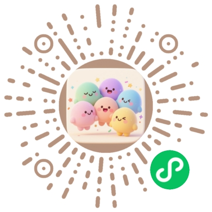

# 他晓公众号推文 Skill V3

## 概述

V3 版本是从已发布的文章（AI订阅套餐全景扫描、Demo Day 会议纪要/创意延伸）中提炼的完整写作规范。核心改进：**全内联样式 + HTML align 属性**，确保粘贴到 135 编辑器 → 微信公众号后格式完美保留。

## 一、写作风格规范

### 1.1 语气与风格
- **定位**：专业但不枯燥，适合科技/AI 爱好者阅读
- **语气**：客观、有洞察力，避免过度营销感
- **人称**：第三人称叙述为主，适当使用「你」拉近距离
- **句式**：中短句为主，每段 2-4 句，避免大段文字

### 1.2 标题规范
- 主标题格式：`主题名：核心观点（上/下）`
- 副标题：补充说明，用 `·` 分隔关键信息
- 示例：
  - 主标题：`Demo Day：我如何与 Agents 共事（上）`
  - 副标题：`2026年4月24日 · 线上分享会 · 近3小时干货 · 14位嘉宾实战分享`

### 1.3 正文规范
- **段落**：每段 1 个核心观点，2-4 句话
- **强调**：关键概念用 `<strong style="color:#1565C0; font-weight:600;">` 包裹
- **引用**：用「」包裹中文引用，不用""
- **连接词**：适当使用破折号（——）和箭头（→）
- **数字**：使用阿拉伯数字（14位、50个、3小时）

### 1.4 结构模式

根据文章类型选择：

**A. 会议/活动纪要型**
```
开头引入（活动背景 + 信息卡片）
→ 嘉宾/主题分段（每人/每主题一段）
  → 标题：序号 + 姓名 + 身份
  → 1-2 段核心观点
  → 金句 callout 框（可选）
  → 产品/链接卡片（可选）
→ 分隔线（每 3-4 个嘉宾后）
→ 共性洞察总结
→ 下期预告（如有续篇）
```

**B. 创意延伸/观点型**
```
开头引入（承接上篇 + 引出主题）
→ 创意点/观点分段
  → 标题：序号 + 「概念名」—— 副标题
  → 灵感来源
  → 延伸思考（2-3 段）
  → 核心观点 callout 框
→ 总结与行动建议
→ 上篇回顾（如有上篇）
```

**C. 数据对比/科普型**
```
开头引入（为什么写这篇文章）
→ 数据表格/对比卡片
→ 关键发现/洞察
→ 选购/使用指南
→ 链接汇总
```

## 二、排版规范（微信公众号兼容）

### 2.1 核心原则
- **所有样式必须内联**，不使用 `<style>` 标签（会被微信过滤）
- **正文段落必须加 `align="left"`**（微信忽略 CSS text-align，但识别 HTML align 属性）
- **居中元素用 `style="text-align:center"`**（header、footer、分隔线等）
- **不使用 `display:flex` / `display:grid`**（微信支持不稳定）
- **布局用 `<table>` 替代 flex/grid**（如双二维码并排）

### 2.2 配色方案

| 用途 | 颜色 | 说明 |
|------|------|------|
| 主色 | `#1976D2` | 品牌蓝，标题左边框、强调文字 |
| 深蓝 | `#1565C0` | strong 强调色 |
| 浅蓝背景 | `#E3F2FD` | callout 框背景 |
| 极浅蓝 | `#F0F7FF` | 链接卡片背景 |
| 正文色 | `#1A2332` | 标题文字 |
| 辅助文字 | `#4A5568` | 正文段落 |
| 弱化文字 | `#718096` | 副标题、提示 |
| 边框 | `#E2E8F0` | 卡片边框 |
| 分隔线 | `#BBDEFB` | 淡蓝分隔点 |

### 2.3 字体

- 标题：`font-family:Georgia,'Noto Serif SC',serif`
- 正文：系统默认（不设置 font-family，微信会用系统字体）

### 2.4 常用组件（复制即用）

**段落文字**：
```html
<p style="font-size:15px; color:#4A5568; line-height:2; margin:0 0 14px; " align="left">正文内容，<strong style="color:#1565C0; font-weight:600;">重点内容</strong>。</p>
```

**二级标题**：
```html
<h2 style="font-family:Georgia,'Noto Serif SC',serif; font-size:19px; font-weight:700; color:#1A2332; margin:0 0 16px; padding-left:14px; border-left:3px solid #1976D2;">标题文字</h2>
```

**编号标题**：
```html
<h2 style="font-family:Georgia,'Noto Serif SC',serif; font-size:19px; font-weight:700; color:#1A2332; margin:0 0 16px; padding-left:14px; border-left:3px solid #1976D2;">01 &nbsp;姓名 &mdash; 身份</h2>
```

**金句/核心观点 callout**：
```html
<div style="background:#E3F2FD; border-left:4px solid #1976D2; border-radius:0 12px 12px 0; padding:18px 16px; margin:18px 0;">
  <div style="display:inline-block; font-size:11px; font-weight:600; color:#1976D2; background:#FFFFFF; padding:2px 10px; border-radius:8px; margin-bottom:10px; box-shadow:0 1px 3px rgba(25,118,210,0.06);">金句</div>
  <p style="font-size:14px; color:#4A5568; line-height:2; margin:0;" align="left">金句内容</p>
</div>
```

**信息卡片**：
```html
<div style="background:#FFFFFF; border:1px solid #E2E8F0; border-radius:12px; padding:18px 16px; margin:16px 0; box-shadow:0 1px 3px rgba(25,118,210,0.06);">
  <div style="font-size:13px; color:#4A5568; line-height:2.2;">
    <span style="font-weight:600; color:#1976D2;">标签：</span>内容<br/>
  </div>
</div>
```

**链接卡片**：
```html
<div style="margin:10px 0; padding:10px 14px; background:#F0F7FF; border-radius:8px; border-left:3px solid #1976D2;">
  <span style="font-size:13px; color:#1976D2;">🔗 产品：</span>
  <a href="https://example.com" target="_blank" style="font-size:13px; color:#1565C0; text-decoration:none; word-break:break-all;">https://example.com</a>
</div>
```

**分隔线**：
```html
<div style="text-align:center; margin:28px 0; color:#BBDEFB; font-size:18px; letter-spacing:8px;">&bull; &bull; &bull;</div>
```

**内容段落容器**：
```html
<div style="margin-bottom:32px;" align="left">
  <!-- 标题 + 段落 + callout -->
</div>
```

**链接列表（垂直布局，支持自动换行）**：
```html
<div style="background:#FFFFFF; border:1px solid #E2E8F0; border-radius:12px; padding:14px 18px; box-shadow:0 1px 3px rgba(25,118,210,0.06);">
  <div style="padding:10px 0; border-bottom:1px solid #F0F2F5;">
    <div style="font-size:13px; font-weight:600; color:#1A2332; margin-bottom:4px;">平台名称</div>
    <a href="https://example.com" target="_blank" style="font-size:12px; color:#1976D2; text-decoration:none; word-break:break-all; line-height:1.6;">https://example.com</a>
  </div>
  <!-- 更多链接... -->
</div>
```

**双二维码并排（table 布局）**：
```html
<table style="margin:0 auto 20px; border-collapse:collapse;">
  <tr>
    <td style="width:50%; text-align:center; padding:0 8px; vertical-align:top;">
      <div style="background:#FFFFFF; border:1px solid #E2E8F0; border-radius:14px; padding:16px 12px; box-shadow:0 1px 3px rgba(25,118,210,0.06);">
        
        <div style="font-family:Georgia,'Noto Serif SC',serif; font-size:14px; font-weight:600; color:#1976D2; margin-bottom:4px;">公众号 · 他晓</div>
        <div style="font-size:11px; color:#718096;">关注获取更多内容</div>
      </div>
    </td>
    <td style="width:50%; text-align:center; padding:0 8px; vertical-align:top;">
      <div style="background:#FFFFFF; border:1px solid #E2E8F0; border-radius:14px; padding:16px 12px; box-shadow:0 1px 3px rgba(25,118,210,0.06);">
        
        <div style="font-family:Georgia,'Noto Serif SC',serif; font-size:14px; font-weight:600; color:#1976D2; margin-bottom:4px;">小程序 · 人格派对</div>
        <div style="font-size:11px; color:#718096;">开启你的探索之旅</div>
      </div>
    </td>
  </tr>
</table>
```

## 三、使用方法

### 3.1 读取模板
```
Read assets/template.html
```

### 3.2 组装推文
1. 将用户内容写入 `<!-- ===== ARTICLE CONTENT START ===== -->` 和 `<!-- ===== ARTICLE CONTENT END ===== -->` 之间
2. 替换 `{{TITLE}}` 和 `{{SUBTITLE}}`
3. 所有正文 `<p>` 必须加 `align="left"`
4. 所有内容 `<div>` 必须加 `align="left"`
5. 不使用 `<style>` 标签
6. 不使用 `display:flex` / `display:grid`

### 3.3 输出
- 文件名格式：`{文章主题}_公众号推文.html`
- 同时将 `assets/` 复制到输出目录的 `assets/` 子文件夹
- 图片路径使用相对路径：`{文件名}_assets/xxx.png`

### 3.4 封面图
- 尺寸：900×383（微信公众号文章封面比例 2.35:1）
- 无水印（使用 Pillow 程序化生成，不用 AI 图片生成）
- 文件名：`{文章主题}_封面.png`
- 风格：根据文章主题选择（科技蓝/暖色渐变/杂志风等）

## 四、资源文件

| 文件 | 用途 |
|------|------|
| `avatar.png` | 公众号头像 |
| `qrcode_gzh.jpg` | 公众号二维码 |
| `qrcode_xcx.jpg` | 小程序二维码 |
| `qrcode_wechat.png` | 微信二维码（社群邀请） |
| `header_deco.png` | 开头装饰图 |
| `footer_deco.png` | 结尾装饰图 |
| `template.html` | 完整 HTML 模板（全内联样式） |
